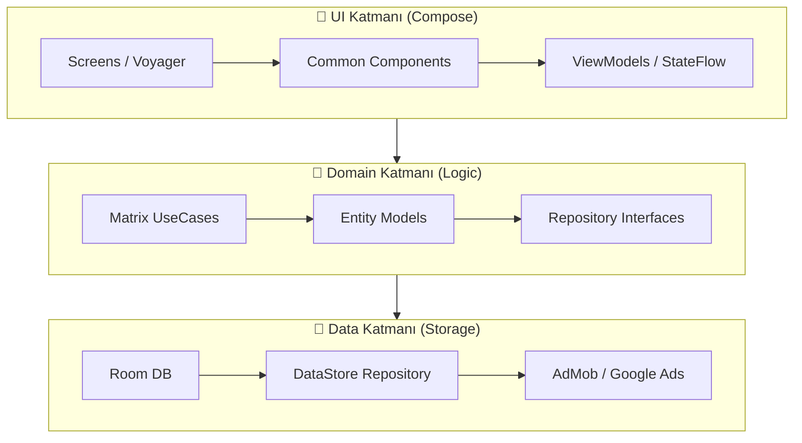

<div align="center">

# 🚀 Equatix: The Ultimate Matrix Engine 🧩

<p align="center">
  
</p>

### *Premium Cross-Platform Math Puzzle Experience*


<br/>

[](https://github.com/vahitkeskin/Equatix)
[](LICENSE)
[](https://github.com/vahitkeskin/Equatix)
[](https://developer.android.com)
[](https://developer.android.com/about/versions/15)

---

[🎮 Özellikler](#-ana-özellikler) • [🏛️ Mimari](#️-mimari) • [🛠️ Tech Stack](#️-tech-stack) • [📂 Yapı](#-proje-yapısı) • [🎨 Tasarım](#-tasarım-sistemi) • [🚀 Başlangıç](#-hızlı-başlangıç)

</div>

---

## ✨ Neden Equatix?

> 💡 **Equatix**, sadece bir bulmaca oyunu değil; matematiksel akıl yürütmeyi görsel bir şölenle birleştiren, **Clean Architecture** prensipleriyle döşenmiş kurumsal düzeyde bir **multiplatform** projesidir.

<table>
<tr>
<td align="center" width="33%">
<h3>🎯 Bilişsel Eğitim</h3>
<p>Matris tabanlı bulmacalarla işlem hızınızı ve dikkat sürenizi %30 artırın.</p>
</td>
<td align="center" width="33%">
<h3>🏎️ Yerel Performans</h3>
<p>KMP sayesinde Android, iOS ve Desktop üzerinde 60 FPS akıcı deneyim.</p>
</td>
<td align="center" width="33%">
<h3>✨ Premium Tasarım</h3>
<p>Modern Glassmorphism ilkeleriyle hazırlanan, gözü yormayan arayüz.</p>
</td>
</tr>
</table>

---

## 📱 Ana Özellikler

### 🧬 Akıllı Matris Üretim Motoru
> *Sonsuz olasılık, tek hedef: Matematiksel kusursuzluk.*

<table>
<tr>
<td width="60%">

**Motorun Kalbi:**
- 🧩 **High-Entropy Generation**: Her oyun başlangıcında benzersiz bir matris matematiksel olarak garanti edilir.
- ⚡ **Real-time Validation**: Kullanıcı girişi yaptığı anda O(1) karmaşıklığında anlık doğrulama.
- 🟠 **Kademeli Zorluk**: 
    - 🟢 Easy (3x3 - Toplama/Çıkarma)
    - 🟠 Medium (4x4 - Çarpma Dahil)
    - 🔴 Hard (5x5 - Tüm İşlemler)
- 💡 **AI-Powered Hints**: Tıkandığınız yerlerde mantıklı hücre açılımları yapabilen zeki ipucu sistemi.

</td>
<td width="40%">


</td>
</tr>
</table>

---

### 🎨 Görsel Mükemmellik (Glassmorphism)
> *Şeffaflığın ve derinliğin matematiği.*

<table>
<tr>
<td width="40%">


</td>
<td width="60%">

**Tasarım Detayları:**
- ✨ **GlassBox Container**: Özel olarak geliştirilen bulanık arka planlı (blur) içerik kutuları.
- 🌓 **Dinamik Tema Motoru**: Sistem ayarlarına veya kullanıcı tercihine göre Dark/Light mode arası akışkan geçiş.
- 🎭 **Lottie & Compose Animations**: Etkileşimli geri bildirimler için optimize edilmiş animasyon katmanları.
- 🎡 **Custom Time Picker**: Süre ve zorluk seçimleri için geliştirilmiş premium wheel-picker bileşeni.

</td>
</tr>
</table>

---

### 📊 İlerleme ve Veri Yönetimi
> *Her başarınız kayıt altında.*

<table>
<tr>
<td width="60%">

**Sistem Detayları:**
- 💾 **Room KMP persistence**: Tüm oyun geçmişiniz ve istatistikleriniz yerel veritabanında güvenle saklanır.
- 📜 **Detailed Logs**: Skor, hamle sayısı ve tamamlama süresi üzerinden performans analizi.
- ⚙️ **DataStore Sync**: Uygulama ayarları (ses, tema, zorluk) asenkron olarak saklanır ve anında yüklenir.
- 🔔 **Achievement System**: Belirli başarılarda tetiklenen görsel bildirimler ve ödüller.

</td>
<td width="40%">


</td>
</tr>
</table>

---

## 🏗️ Mimari (The Blueprint)

Equatix, sürdürülebilir ve test edilebilir bir yapı için **Layered Architecture** kullanır.

### 💎 Mimari Katman Görseli
<p align="center">
  
</p>

### 🛠️ Teknik Katman Detayları


- **Domain Layer**: Hiçbir dış bağımlılığı olmayan, saf Kotlin kodundan oluşur. Tüm matris hesaplama ve kural motoru buradadır.
- **Data Layer**: Veritabanı işlemleri, shared preferences (DataStore) ve üçüncü parti servislerin (Ads) yönetimini yapar.
- **Presentation Layer**: Compose Multiplatform kullanılarak yazılmış, UI State yönetimini ViewModel'lar üzerinden yapan katmandır.

---

## 🛠️ Detaylı Tech Stack

### 🏗️ Ana Teknolojiler

| Kategori | Teknoloji | Sürüm | Açıklama |
| :--- | :--- | :--- | :--- |
| **Dil** |  | 2.1.0 | K2 Compiler desteği ile tip güvenli kod |
| **UI** |  | 1.7.1 | Common UI Framework (95% Shared) |
| **DI** |  | 4.0.0 | Lightweight KMP dependency injection |
| **Persistence** |  | 2.7.0 | SQLite tabanlı ortak veritabanı |

### ⚡ Yardımcı Sistemler
- **Voyager**: KMP için geliştirilmiş, State management uyumlu multiplatform navigasyon.
- **Coroutines & Flow**: Reaktif veri akışları için standart asenkron çözüm.
- **DataStore**: Modern, asenkron Key-Value depolama.
- **AdMob**: Android/iOS üzerinde banner, interstitial ve rewarded reklam entegrasyonu.

---

## 📂 Proje Yapısı

```bash
Equatix/
├── 📂 composeApp/                  # 🚀 Ortak Uygulama Katmanı
│   └── 📂 src/
│       ├── 📂 commonMain/          # 🧠 Business Logic & UI (%95 Paylaşım)
│       │   ├── 📂 ui/              # Tasarım Sistemi ve Ekranlar
│       │   │   ├── 📂 game/        # Matris Logic ve Oyun Görselleri
│       │   │   ├── 📂 home/        # Karşılama ve Mod Seçimi
│       │   │   └── 📂 theme/       # Renk Paleti ve Yazı Tipleri
│       │   ├── 📂 domain/          # Saf Kotlin Modelleri ve Kurallar
│       │   ├── 📂 data/            # Room DB ve DataStore yönetimi
│       │   └── 📂 di/              # Koin Dependency Injection
│       ├── 📂 androidMain/         # 🤖 Android-specific implementation
│       ├── 📂 iosMain/             # 🍎 iOS Objective-C/Swift interoperability
│       └── 📂 desktopMain/         # 🖥️ JVM/Desktop Hooks
└── 📂 iosApp/                      # 🍏 Native iOS entry (XCode Project)
```

---

## 🎨 Tasarım Sistemi (Equatix Design System)

### 🎨 Renk Paleti

| Mod | Renk Adı | Hex | Kullanım Alanı |
| :--- | :--- | :--- | :--- |
| 🌑 **Dark** | **Deep Base** | `#0B1121` | Ana Arka Plan (Göz Dostu) |
| 🌑 **Dark** | **Sky Primary** | `#38BDF8` | Neon Mavi Accent & Odak |
| ☀️ **Light** | **Slate White** | `#F8FAFC` | Akademik Beyaz Arka Plan |
| ⚠️ **Common** | **Error Red** | `#FF453A` | Hatalı İşlemler ve Uyarılar |

---

## 📸 Ekran Görüntüleri

|  |  |  |
| :---: | :---: | :---: |
|  |  |  |

---

## 📄 Lisans
Bu proje **MIT Lisansı** altında lisanslanmıştır.

<div align="center">

**Vahit Keskin** tarafından ❤️ ile geliştirildi

[](https://www.linkedin.com/in/vahit-keskin/)
[](https://github.com/vahitkeskin)

---

<sub>⭐ Bu projeyi beğendiyseniz yıldız vermeyi unutmayın!</sub>

</div>